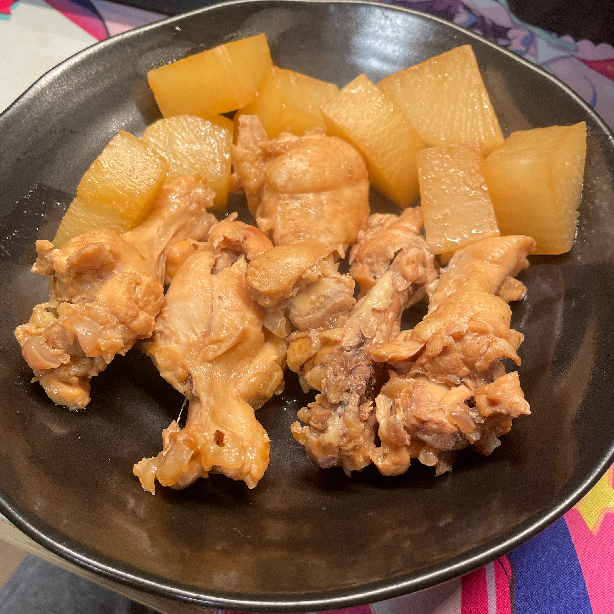

# 鶏肉の手羽元と大根のさっぱり煮 レシピ 🐓

## はじめに

- 鶏肉と大根を入れてポン酢、お酢で煮込むだけでほろほろの手羽元煮込みができます。
- 次の日も食べれるように少し多めに材料を用意しています。

## 必要な道具 🍲

- 深い鍋
- 包丁
- まな板
- すりおろし器
- キッチンペーパー

## 作業時間 ⏰️

- 約30分から45分

## 材料 (2人前想定) 

- 鶏肉の手羽元
  - 500gくらい
- 大根
  - 半分
- 酢
  - 100ml
- お水
  - 350ml
- お砂糖
  - 小さじ2くらい(5g)
- 生姜
  - 1かけをすりおろしてください
  - **チューブでもおk**
    - すりおろすと香りが出て美味しくなります。
    - あと生臭さを消すために入れてるはずです。
- ごま油
  - 大さじ1(15g)

## 調理手順 🔪

### 大根編

1. 大根を洗う
2. 大根を2cm幅で切り分ける
3. 大根の皮を剥く
   1.  桂剥きができる人はやってみてください
   2.  こわかったらピーラーで皮を剥いてください
4.  大根をいちょう切りで切り分ける

### 鶏肉編

1. 深い鍋にごま油をひく
2. 火を付ける(中火くらい)
3. 手羽元を皮目から焼く
4. 軽く焼色がついたら火を止める

### 煮込み編

1. 火が止まっていることを確認する
2. 鶏肉が入った鍋に大根を入れる
3. お水、お酢、生姜、お砂糖を入れて火を付ける(中火よりの弱火)
4. キッチンペーパーで落し蓋を作り蓋をして煮込む
5. 20分くらい経ったら中を確認していい感じだったら完成
   1. だいこんに楊枝を刺してｽｯっと通ればOKです

## 備考 🍙

- 料理初心者でも比較的簡単に作れると思います！
- 包丁使うの苦手でしたらピーラーを必ず使ってください！
- 煮込み料理なので1.5~2日くらいは日持ちすると思います。
  - ※割とすぐ食べ終わっちゃう想定なので次の日のご飯になるかなの分量で用意しています。

---

## 参考画像

