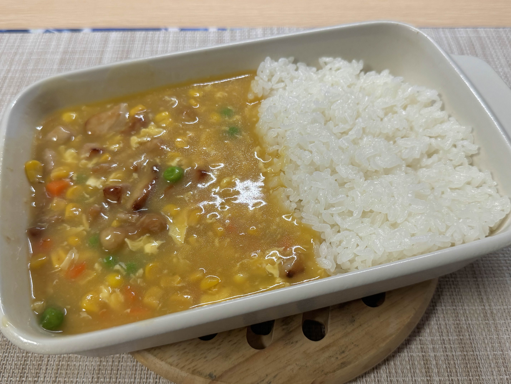

# 豚肉とトウモロコシあんかけご飯

## はじめに

香港で定番のプレート飯の1つを日本のご家庭でも簡単に再現できるレシピです。

## 必要な道具

- まな板
- 包丁
- フライパン

## 作業時間

- 45分程度

## 材料

- 基本材料
  - 豚肉切り身
    - 300g
  - キャンベルスープ　コーンポタージュ　2倍濃縮
    - 1缶
  - 水
    - ↑の1缶
  - 鶏ガラスープの素
    - 小さじ2
  - 水溶き片栗粉
    - 片栗粉
      - 小さじ1
    - 水
      - 小さじ2
  - たまご
    - 1こ
- 豚肉下味
  - 醤油
    - 小さじ2
  - 砂糖
    - 小さじ1
  - 片栗粉
    - 小さじ2
  - 塩
    - 少々
  - ごま油
    - 小さじ1

## 調理手順

1.　豚肉を角切りにして**豚肉下味**と揉んで10分ぐらい漬ける
2.　フライパンに油少々入れて豚肉を両面に焼き目がつくまで焼いて取り出す
3.　弱火にして、同じフライパンにコーンポタージュ缶を入れて、缶に水と鶏ガラスープの素入れ混ぜてフライパンに入れる
4.　3を中火にして混ぜながら沸騰させる
5.　水溶き片栗粉入れてとろみをつけて、溶き卵を流し入れる
6.　2の豚肉を戻してひと煮立ちさせて完成

## 備考

- だいたい2食分、1食に1合分のごはんは行けると思います。

## 参考画像

